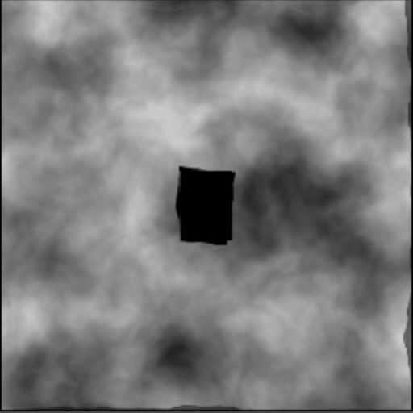
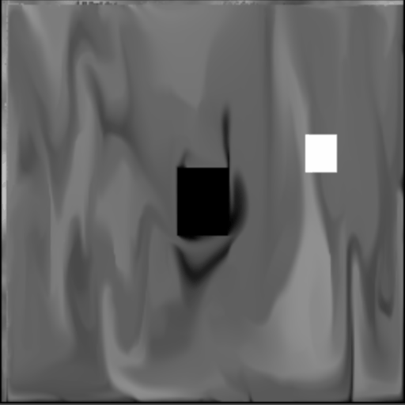
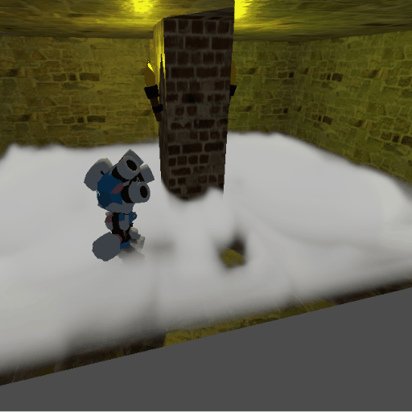
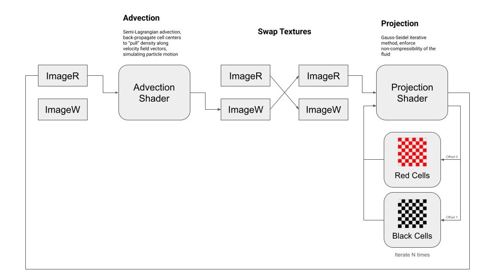

# Eulerian Fluid Sim Compute Shader

Cool, swirly, interactive fluid motion for games through a real-time Eulerian fluid simulation running on the GPU.

  

The shader computes a 2D vector field for fluid velocity, as well as a 2D scalar field for density. These are stored in a texture with 16-bit half-width float channels, with the velocity field on the red and green channels and the density field on the blue channel, and the alpha channel used to flag fluid obstructions for the simulation. As demonstrated in the game code, this texture can be displayed in any number of different ways - here it serves as the input for a FogShader that controls a FogVolume. Game code can interact with the simulation by drawing the movement of entities onto the texture, either emitting or erasing fluid density as they move around.

## How It Works

This is an Eulerian simulation, which means it calculates a velocity field to represent flow rather than representing flow through particles (a Lagrangian simulation). It works by solving the Navier-Stokes equations for incompressible flow, using the Gauss-Seidel iterative method to converge on a solution.

You can learn a lot more about the math involved from nVidia's excellent [GPU Gems, chapter 38](https://developer.nvidia.com/gpugems/gpugems/part-vi-beyond-triangles/chapter-38-fast-fluid-dynamics-simulation-gpu). This simulation differs from the one described there in a few important ways, mainly in that it uses a staggered grid rather than collocated grid for storing the velocity field which allows the addition of obstacle collision and interaction to be much simpler, but the underlying concept is the same.

There are two main steps to the shader (we skip viscous diffusion to save time):
### 1. Advection
The advection step creates flow by having the fluid carry along its velocity and density field with it as it moves.
### 2. Projection
The projection step calculates divergence (the difference between fluid flowing into and out of a cell) and iteratively adjusts velocities to enforce incompressibility until divergence is zero. This step needs to be run for a number of iterations.

Because of our staggered grid model storing velocities at the boundaries of cells rather than at the center, each cell update must affect two neighboring cells as well. Since we want our compute shader to calculate all cells in parallel, we execute it in a Red-Black iteration pattern. It is easiest to imagine this as a checkerboard, in which we first process all the red squares, and then process all of the black squares on the board. Since each cell can only affect its directly adjacent neighbors, all cells of the same color can be executed at the same time without any two parallel operations writing to the same cell.

For this shader, this is accomplished by executing it twice for each iteration, alternating the `uOffset` variable between 1.0 and 0.0 to indicate whether to process the red or black cells.

## Future Improvements

There are quite a lot of improvements that could be made here! Here are a few ideas:

### Neighborhood Processing

For both the projection and the advection step, the compute shader for each cell performs several texture fetches to load the neighboring cells. Since the neighborhood of each cell overlaps, this results in a large number of overlapping fetches, causing the same texel to be fetched multiple times for each iteration. This could be substantially sped up by dividing the processed area into larger working groups and loading all texels into workgroup shared memory in a single fetch, reducing redundant fetches by each individual cell.

### Interacting with the texture through GPU draws
In the current demo, to provide interactivity, the entire velocity field texture is fetched from the GPU, updated on the CPU, and then sent back to the GPU every frame. This is just plain the wrong way to do this, and could be improved substantially by doing all of those draw commands on the GPU.
